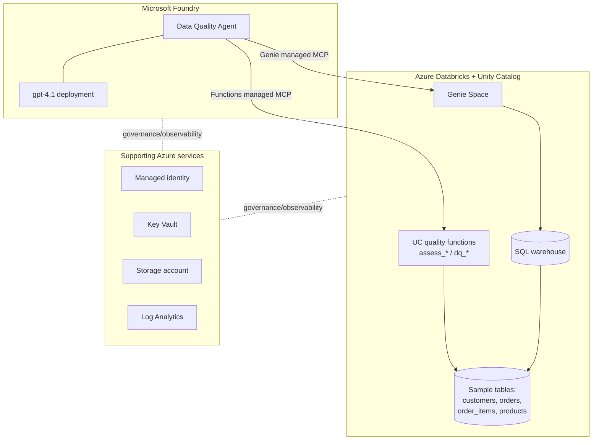

# Architecture

The **Data Quality Agent** is a Microsoft Foundry agent that assesses the quality of Azure
Databricks Unity Catalog tables across six dimensions and returns a scored, actionable
report. This page describes the end-to-end solution and how the pieces fit together.

## Solution overview

## Components

| Layer | Service | Role |
|-------|---------|------|
| Reasoning | **Microsoft Foundry** account + project + `gpt-4.1` | Hosts the agent and the chat model that plans tool calls and writes the report. |
| Data & logic | **Azure Databricks** + Unity Catalog | Stores the sample data; hosts the Genie Space and the governed quality functions. |
| Integration | **Managed MCP servers** | Databricks-hosted MCP endpoints that expose Genie and UC functions to the agent as tools. |
| Identity | **User-assigned managed identity** | Passwordless auth pattern between services. |
| Secrets | **Key Vault** | Holds any connection secrets (RBAC-authorized). |
| Storage | **Storage account** | General-purpose storage for artifacts/logs. |
| Observability | **Log Analytics workspace** | Central logs/metrics destination. |

## Integration patterns

The repo builds two Foundry↔Databricks patterns and documents a third:

| Pattern | Built? | Summary |
|---------|--------|---------|
| [Genie managed MCP](integration/genie-managed-mcp.md) | ✅ Built | Natural-language questions over any table in a Genie Space. |
| [UC Functions managed MCP](integration/uc-functions-managed-mcp.md) | ✅ Built | Deterministic, governed scoring functions called as tools. |
| [Custom MCP server](integration/custom-mcp-server.md) | 📄 Documented | Build-your-own MCP server on Container Apps for arbitrary-table logic. |

See each page for the trade-offs. In short: **UC functions** for repeatable scoring, **Genie**
for ad-hoc questions, and a **custom MCP server** when you outgrow both.

## The six-dimension quality model

Completeness, uniqueness, validity, timeliness, consistency, accuracy. Each is scored in
`[0,1]`; the composite is their mean; the composite maps to a severity band
(Healthy / Needs Attention / High Risk / Critical) with a recommended action. Full
definition and output contract: [`agent/SKILL.md`](../agent/SKILL.md).

## Request flow (UC Functions example)
1. A user asks the agent to "assess the customers table."
2. `gpt-4.1` plans a call to the `assess_customers` tool (functions managed MCP).
3. Databricks executes the governed function and returns a per-dimension scorecard.
4. The agent calls `dq_composite` / `dq_severity` (or computes them) and composes the report.
5. The agent returns the headline score, per-dimension findings, and recommendations.

## What is and isn't Infrastructure-as-Code
- **Bicep-deployable (in [`/infra`](../infra)):** resource group, Databricks workspace,
  Foundry account + project + model deployment, managed identity, Key Vault, Storage, Log
  Analytics, and role assignments.
- **Portal / preview click-ops (documented, not Bicep):** enabling the Managed MCP Servers
  preview, creating the Genie Space, and connecting the MCP tools to the Foundry agent.
  These are Public Preview and not ARM-deployable today.

## Regions & models
- Reference deployment region: **East US 2** (change via Bicep parameters).
- Chat model: **`gpt-4.1`** (GA; strong tool-calling). Swap via the `modelName` parameter if
  you prefer another deployment; confirm quota in your region first.
