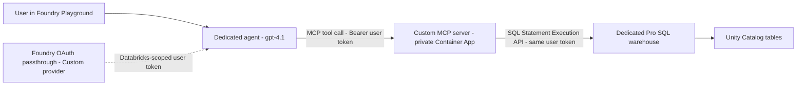

# Custom MCP server (build-your-own, dedicated compute)

**Status: built and verified private in this project.** &nbsp;·&nbsp; This is the
"build-your-own" pattern for teams that need logic beyond governed Unity Catalog functions
or Genie — an **"assess any table"** tool with your own code path, running on **dedicated
(classic) compute** with **no public network access**.

Unlike the two managed MCP paths (Unity Catalog Functions and Genie, which run on
**serverless**), this pattern hosts your **own** MCP server on **Azure Container Apps** and
points it at a **dedicated Pro SQL warehouse**. The server wraps the Databricks **SQL
Statement Execution API** plus the same six-dimension scoring engine used by the UC Functions
path, so results are directly comparable to the baseline.

## When to use it
- You need to assess **arbitrary** tables with a single tool and want **your own** code path
  (not Genie) to generate and score the SQL.
- Your organisation requires the custom path to run on **dedicated compute** rather than
  serverless (a common data-residency / cost-isolation requirement).
- You want a house rule-pack library, a generic profiler for unknown tables, result caching,
  or history — logic that does not fit cleanly into per-table UC functions.
- You want the MCP server portable across agent platforms, not tied to Databricks-managed
  endpoints.

## How it works



- The Foundry agent uses **OAuth Identity Passthrough (Custom provider)** to obtain a token
  scoped to Azure Databricks (`2ff814a6-3304-4ab8-85cb-cd0e6f879c1d/user_impersonation`) on the
  **signed-in user's** behalf, and forwards it as `Authorization: Bearer` on every tool call.
- The MCP server **forwards that same token** to the SQL Statement Execution API. It holds **no
  service credential** of its own for the data path — Unity Catalog enforces each caller's own
  grants, and the Databricks audit log shows the real user.
- The server runs on a **dedicated Pro (classic) SQL warehouse**, not serverless.

### Auth model (approach A — direct passthrough)

The MCP server never stores a Databricks secret. The Entra **OAuth client app** lives in
Foundry's connection; Foundry requests the Databricks-scoped user token and passes it through.
An **on-behalf-of (OBO) exchange** is a documented fallback if you would rather protect the
endpoint by its own audience — but for the passthrough design here it is not required.

## Prerequisites
- The private Databricks workspace from the [private-networking build](../private-networking.md)
  (VNet-injected, `publicNetworkAccess=Disabled`), with the `<catalog>.<schema>` sample data and
  scoring functions seeded.
- An existing **internal (VNet-injected) Azure Container Apps environment** and an existing
  **private Azure Container Registry** (`publicNetworkAccess=Disabled`) in the shared hub — this
  project reuses both rather than deploying new ones.
- Azure CLI + Bicep, run from a host with private line-of-sight to the workspace (VPN / DevBox).
- Permission to create an Entra app registration and grant admin consent.

> Every Foundry user who calls the tool must be a Databricks principal with Unity Catalog grants
> on the tables and `CAN USE` on the warehouse. See Step 6.

## Step 1 — Build the image into the private registry
The MCP server source is in [`mcp-server/`](../../mcp-server/) (see its
[README](../../mcp-server/README.md)). Build straight into the private ACR — no local Docker
needed:

```bash
az acr build --registry <registry-name> --image dq-mcp-server:v1 mcp-server/
```

> If the registry has `publicNetworkAccess=Disabled`, `az acr build` cannot use the shared build
> agent (its IP is firewalled out). Create a **dedicated agent pool** in a subnet of the hub VNet
> and pass `--agent-pool <pool>`; the build then runs inside your network. Delete the pool when
> you are done iterating.

## Step 2 — Create the dedicated Pro SQL warehouse
Create a **Pro (classic, non-serverless)** warehouse in the private workspace and capture its id:

```bash
databricks warehouses create --json '{
  "name": "dq-dedicated-pro",
  "warehouse_type": "PRO",
  "enable_serverless_compute": false,
  "cluster_size": "2X-Small",
  "auto_stop_mins": 10
}'
```

> A classic Pro warehouse cold-starts in ~4 minutes (it provisions VMs), noticeably slower than
> serverless. The server polls the warehouse to `RUNNING` before issuing statements.

## Step 3 — Deploy the MCP server to Container Apps
Deploy with [`infra/private/custom-mcp/container-app.bicep`](../../infra/private/custom-mcp/container-app.bicep).
It creates a user-assigned identity, grants it **AcrPull** on the private registry, and deploys
the app into the **existing internal environment**:

```bash
az deployment group create \
  --resource-group <spoke-resource-group> \
  --template-file infra/private/custom-mcp/container-app.bicep \
  --parameters \
      managedEnvironmentId=<aca-environment-resource-id> \
      acrLoginServer=<registry-name>.azurecr.io \
      acrResourceId=<acr-resource-id> \
      image=<registry-name>.azurecr.io/dq-mcp-server:v1 \
      databricksHost=<databricks-host> \
      databricksWarehouseId=<warehouse-id>
```

Notes for an **internal** Container Apps environment:
- Set ingress `external: true`. On an internal environment this is still **private-only** (the
  whole environment has no public IP), but it lets the environment's envoy route the app. With
  `external: false` the FQDN is `<app>.internal.<domain>` and returns a 404 "Unavailable".
- The MCP SDK enables **DNS-rebinding protection** by default and rejects non-localhost `Host`
  headers with HTTP 421. The template sets `MCP_ALLOWED_HOSTS` to the ingress FQDN so the private
  host is allow-listed. (Behind a trusted proxy you may instead disable the check.)

Verify the endpoint from inside the VNet:

```bash
TOKEN=$(az account get-access-token --resource 2ff814a6-3304-4ab8-85cb-cd0e6f879c1d --query accessToken -o tsv)
curl -s https://<container-app-fqdn>/mcp \
  -H "Authorization: Bearer $TOKEN" \
  -H "Content-Type: application/json" \
  -H "Accept: application/json, text/event-stream" \
  -d '{"jsonrpc":"2.0","id":1,"method":"tools/list","params":{}}'
```

You should see `list_tables` and `assess_table`.

## Step 4 — Register the Entra OAuth client app
Foundry's OAuth passthrough needs an Entra application to act as the OAuth **client**. Deploy
[`infra/private/custom-mcp/entra-app.bicep`](../../infra/private/custom-mcp/entra-app.bicep)
(Microsoft Graph Bicep extension). It creates the app + service principal and admin-consents the
Azure Databricks `user_impersonation` delegated permission.

Two things Bicep cannot emit declaratively — do them as post-steps:

```bash
# 1) Generate a client secret for the Foundry connection (Bicep cannot output secrets):
az ad app credential reset --id <client-id> --display-name foundry-oauth --years 1

# 2) After the Foundry OAuth connection exists (Step 5), add its redirect URI back to the app:
az ad app update --id <client-id> --web-redirect-uris <foundry-redirect-uri>
```

The portal equivalent (App registrations → New registration → API permissions → add Azure
Databricks `user_impersonation` → Grant admin consent → Certificates & secrets → New client
secret) is fully supported if you prefer clicking.

## Step 5 — Add the custom MCP tool in Foundry (dedicated agent)
Create a **new, dedicated agent** so the custom-server path is demoed cleanly, separate from the
managed agent:

1. In the Foundry portal, create an agent `data-quality-agent-dedicated` (model `gpt-4.1`).
2. **Add tool → Custom → MCP.**
   - **Server URL:** `https://<container-app-fqdn>/mcp`
   - **Authentication:** **OAuth Identity Passthrough → Custom** with:
     - Authorize URL: `https://login.microsoftonline.com/<tenant-id>/oauth2/v2.0/authorize`
     - Token URL: `https://login.microsoftonline.com/<tenant-id>/oauth2/v2.0/token`
     - Client ID / Client secret: from Step 4
     - Scope: `2ff814a6-3304-4ab8-85cb-cd0e6f879c1d/user_impersonation offline_access`
   - Use a **dash-only** connection name (underscores are rejected by name validation).
3. Copy the connection's **redirect URI** and complete post-step 2 in Step 4.
4. Give the agent Instructions that route "assess any table / check data quality on
   `<catalog>.<schema>.<table>`" requests to the `assess_table` tool and reuse the six-dimension
   scoring contract from [`agent/SKILL.md`](../../agent/SKILL.md).

> The tool endpoint (`server_url`) is fixed by the connection and is **not editable** after the
> connection is created — create a new connection if it changes.

### Code-driven alternative (repeatable)
The connection and the agent are **data-plane** objects (not ARM/Bicep), so the repeatable,
committed equivalent of the wizard above is a script:
[`agent/create_dedicated_agent.py`](../../agent/create_dedicated_agent.py). It is standard-library
only and reads every value from environment variables (no environment-specific values in the repo):

```bash
export AZURE_SUBSCRIPTION_ID=<subscription-id>
export FOUNDRY_RESOURCE_GROUP=<resource-group>
export FOUNDRY_ACCOUNT=<foundry-account>
export FOUNDRY_PROJECT=<project-name>
export FOUNDRY_ENDPOINT=https://<foundry-account>.services.ai.azure.com
export MCP_SERVER_URL=https://<container-app-fqdn>/mcp
export ENTRA_TENANT_ID=<tenant-id>
export OAUTH_CLIENT_ID=<client-id>
export OAUTH_CLIENT_SECRET=<client-secret>
python agent/create_dedicated_agent.py
```

It creates the OAuth2 `RemoteTool` connection (via ARM) and the dedicated prompt agent bound to it
(via the project agents API), then reminds you of the two interactive post-steps (register the
Foundry redirect URL on the Entra app; sign in once in the Playground to consent). The connection's
redirect URL is generated by Foundry, so it is captured from the portal connection screen after this
runs — it is not returned by the API.

## Step 6 — Grant the user in Databricks and test
Grant your test user Unity Catalog + warehouse access, then verify in the Playground:

```sql
GRANT USE CATALOG ON CATALOG <catalog> TO `<user@tenant>`;
GRANT USE SCHEMA  ON SCHEMA  <catalog>.<schema> TO `<user@tenant>`;
GRANT SELECT      ON SCHEMA  <catalog>.<schema> TO `<user@tenant>`;
-- plus CAN USE on the dedicated warehouse (Warehouse → Permissions in the UI)
```

In the Playground, sign in / consent once, then ask the dedicated agent to *"assess the data
quality of `<catalog>.<schema>.customers`"*. Confirm:
- a **custom-MCP tool span** in the trace,
- a **composite score matching the baseline** (the seeded `customers` table scores ~0.77 "High
  Risk"; the healthy `products` table scores 1.0),
- the Databricks audit log attributes the query to **your user**, and
- all traffic stayed **private** (the workspace resolves to its private-endpoint IP).

## Private networking
- **Front-end** access is already private: the MCP server calls the workspace REST API through
  the existing `databricks_ui_api` **private endpoint**, and Foundry reaches the Container App
  over the environment's private ingress (no public IP anywhere in the path).
- **Back-end Private Link** (the SCC relay + REST channel used by classic clusters) is an
  **optional** enhancement. The SQL Statement Execution API path used here does not require it, so
  this build documents it as future hardening rather than deploying it.

## Trade-offs vs. the other patterns
| | Genie | UC functions | Custom MCP server |
|-|-------------------|--------------------------|--------------------|
| Compute | serverless | serverless | **dedicated (Pro)** |
| Arbitrary tables | ✅ | ❌ (per-table) | ✅ |
| Deterministic scoring | ⚠️ NL-driven | ✅ | ✅ |
| You host code | ❌ | ❌ | ✅ (Container Apps) |
| Custom rule packs / generic profiler | ⚠️ limited | ⚠️ via more functions | ✅ |
| Auth | OAuth passthrough | Entra + Project MI | OAuth passthrough |
| Ops overhead | lowest | low | highest |

Most teams should start with **Genie + UC functions** and reach for a **custom MCP server** only
when they need arbitrary-table scoring on dedicated compute or logic the managed paths can't
express.

## References
- [Databricks SQL Statement Execution API](https://learn.microsoft.com/azure/databricks/sql/api/sql-execution-tutorial)
- [Azure Container Apps overview](https://learn.microsoft.com/azure/container-apps/overview)
- [Build images with a private ACR agent pool](https://learn.microsoft.com/azure/container-registry/tasks-agent-pools)
- [Microsoft Graph Bicep extension](https://learn.microsoft.com/graph/templates/bicep/overview)
- [Model Context Protocol](https://modelcontextprotocol.io/)
- [Connect a custom MCP server to a Foundry agent](https://learn.microsoft.com/azure/azure-functions/functions-mcp-foundry-tools)
