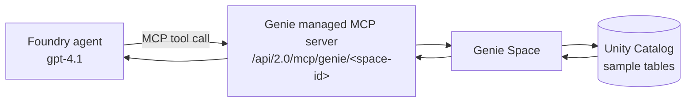

# Genie Space managed MCP server

**Status: built in this demo.** &nbsp;·&nbsp; **Preview:** Databricks managed MCP servers and
Genie-in-Foundry are Public Preview.

Connect a Databricks **Genie Space** to a Microsoft Foundry agent as a tool using the
Databricks **managed MCP server**. Genie translates the agent's natural-language questions
into governed SQL over your Unity Catalog data — no glue code to write or host.

## When to use it
- You want **natural-language** access to **arbitrary** tables/views in a schema.
- You want Databricks to own the SQL generation and governance.
- Good complement to the Unity Catalog Functions pattern: use governed functions for
  deterministic scoring, and Genie for ad-hoc "why" questions.

## How it works



The managed MCP server endpoint is:

```
https://<databricks-host>/api/2.0/mcp/genie/<genie-space-id>
```

(Omit the space id — `.../api/2.0/mcp/genie` — to reach Genie across spaces.)

## Prerequisites
- A **Unity Catalog-enabled** workspace with the sample data loaded (see [`/databricks`](../../databricks)).
- The **Managed MCP Servers** workspace preview turned **on**. This is a Databricks portal
  toggle — it is *not* something this repo's Bicep provisions. To check or enable it:
  1. In the Databricks workspace, click your **username** (top-right corner).
  2. Select **Previews** from the menu.
  3. Find **Managed MCP Servers** in the list and switch its toggle **On**.

  The **Previews** menu item and toggles only appear if you're a **workspace admin**. If you
  don't see it, you're not an admin — ask one to enable the preview for the workspace.
- A Foundry project with a chat model deployment (`gpt-4.1`).
- Roles: a Databricks identity that can read the catalog; **Azure AI Developer** on the
  Foundry project.

## Step 1 — Create a Genie Space over the sample data
1. In the Databricks workspace, open **Genie** (SQL → Genie, or the Genie icon).
2. Click **New** → give it a name like `DataHub Quality`.
3. Set the **SQL warehouse** it should use (the Serverless Starter Warehouse is fine).
4. Add the sample tables as the Space's data: `<catalog>.<schema>.customers`, `.orders`,
   `.order_items`, `.products`.
5. Add a few **instructions / example questions** so Genie answers quality questions well,
   for example:
   - "Count rows where email is null in customers."
   - "Find duplicate customer_id values."
   - "List orders whose order_total ≠ sum of order_items."
   - "List orders where ship_date < order_date."
6. Ask a couple of the sample questions in the Genie UI to confirm it returns sensible SQL
   and rows.
7. Copy the **Space ID** from the URL: `https://<databricks-host>/genie/rooms/<space-id>`.

## Step 2 — Add Genie as a tool in Foundry
1. In **Microsoft Foundry**, click **Tools** on the sidebar.
2. Search for and select **Azure Databricks Genie**.
3. Click **Connect** (upper-right).
4. Enter:
   - **Name:** e.g. `databricks-genie`.
   - **Remote MCP Server endpoint:** autopopulated with your Databricks MCP endpoint.
   - **genie_space_id:** the `<space-id>` from Step 1.
   - **workspace-hostname:** your workspace instance name (`<databricks-host>`).
   - **OAuth Identity Passthrough:** **Managed** (Entra authentication — recommended).
5. Click **Connect**.

## Step 3 — Use it in the agent
1. From the connected Genie MCP server, click **Use in an agent** (upper-right).
2. Enter a message for your agent.
3. Click **Open consent** from the agent's response to complete setup.
4. Sign in to Azure Databricks when prompted, then click **Approve** to allow the agent to
   call Genie.

## Verify
Ask the agent one of the Genie prompts from
[`agent/sample-prompts.md`](../../agent/sample-prompts.md), e.g. *"How many customers are
missing an email address?"* The agent should call Genie and return a grounded answer.

## Limitations & notes
- **Rate limit:** up to **5 questions/minute** in preview (lifted when the account moves to
  pay-as-you-go).
- Genie quality depends on good Space instructions and clear table/column comments.
- Genie is best for exploratory NL questions; for **repeatable, deterministic scoring** use
  the [Unity Catalog Functions managed MCP server](uc-functions-managed-mcp.md).
- Not ARM/Bicep-deployable today — the Space and the Foundry tool connection are portal
  steps.

## References
- [Use Azure Databricks Genie in Microsoft Foundry](https://learn.microsoft.com/azure/databricks/integrations/microsoft-foundry)
- [Azure Databricks managed MCP servers](https://learn.microsoft.com/azure/databricks/generative-ai/mcp/managed-mcp)
- [Create and manage a Genie Space](https://learn.microsoft.com/azure/databricks/genie/set-up)
