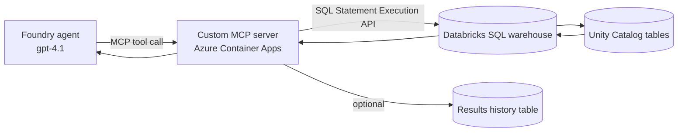

# Pattern E — Custom MCP server (build-your-own)

**Status: documented only (not deployed in this demo).** &nbsp;·&nbsp; This is the
"build-your-own" option for teams that need logic beyond what governed Unity Catalog
functions or Genie provide.

Host your **own** MCP server (e.g. in Python) on **Azure Container Apps**. It wraps the
Databricks **SQL Statement Execution API** and your own scoring engine, and registers with
Foundry as a custom remote MCP tool. This gives you full control: dynamic "assess any table"
logic, custom rule packs, caching, and result persistence.

## When to use it
- You need to assess **arbitrary** tables with a single tool and want **your own** code path
  (not Genie) to generate the SQL.
- You want to enforce a house rule library, write results to a history table, or add caching
  / rate-limit handling.
- You want the MCP server portable across agent platforms, not tied to Databricks-managed
  endpoints.

## Architecture

Key components:
- **Azure Container Apps** — serverless container host for the MCP server (scales to zero).
- **The MCP server** — a small Python app exposing tools like `assess_table(catalog, schema,
  table)` and `list_tables(catalog, schema)`; implements the MCP protocol over HTTP.
- **Databricks SQL Statement Execution API** — `POST /api/2.0/sql/statements` with a
  `warehouse_id`; the server builds profiling SQL dynamically and reads results.
- **Managed identity** — the Container App authenticates to Databricks with an Entra token
  (resource `2ff814a6-3304-4ab8-85cb-cd0e6f879c1d`) instead of storing a PAT.

## Design sketch

The server would expose an `assess_table` tool that, for any table:
1. Reads the table schema (`DESCRIBE`) to pick applicable checks per column type.
2. Generates one profiling query per dimension (completeness, uniqueness, validity,
   timeliness, consistency where FKs are known, accuracy from a rule pack).
3. Runs them via the SQL Statement Execution API against a configured warehouse.
4. Applies the same scoring model as the repo functions (`1 - issues/checks`, composite,
   severity bands) so results are comparable to Pattern B.
5. Returns the JSON output contract from [`agent/SKILL.md`](../../agent/SKILL.md) and,
   optionally, writes a row to a `quality.assessment_history` table for trending.

The repo's `databricks/run_sql.py` is a minimal reference for talking to the Statement
Execution API (auth, submit, poll) that this server would build on.

## Outline of build steps (when you implement it)
1. **Write the MCP server** (Python; an MCP SDK or a lightweight HTTP+JSON-RPC handler).
   Tools: `list_tables`, `assess_table`, `get_history`.
2. **Containerize** it (Dockerfile) and push to **Azure Container Registry**.
3. **Deploy to Azure Container Apps** with ingress enabled and a system-assigned managed
   identity; grant that identity access to Databricks and the warehouse.
4. **Store config** (workspace host, warehouse id) as Container App settings; no secrets if
   using managed identity.
5. **Register in Foundry** via the custom MCP tool flow (same as Pattern B Step 2), pointing
   at `https://<container-app-fqdn>/mcp` with the appropriate authentication.
6. **Add auth** — protect the endpoint (Entra / Easy Auth) and use OAuth identity passthrough
   or on-behalf-of so row-level Unity Catalog governance still applies.

## Trade-offs vs. Patterns A & B
| | Pattern A (Genie) | Pattern B (UC functions) | Pattern E (custom) |
|-|-------------------|--------------------------|--------------------|
| Arbitrary tables | ✅ | ❌ (per-table) | ✅ |
| Deterministic | ⚠️ NL-driven | ✅ | ✅ |
| You host code | ❌ | ❌ | ✅ (Container Apps) |
| Custom rule packs / history | ⚠️ limited | ⚠️ via more functions | ✅ |
| Ops overhead | lowest | low | highest |

Most teams should start with **A + B** (as this demo does) and only reach for **E** when they
outgrow both.

## References
- [Databricks SQL Statement Execution API](https://learn.microsoft.com/azure/databricks/sql/api/sql-execution-tutorial)
- [Azure Container Apps overview](https://learn.microsoft.com/azure/container-apps/overview)
- [Model Context Protocol](https://modelcontextprotocol.io/)
- [Connect a custom MCP server to a Foundry agent](https://learn.microsoft.com/azure/azure-functions/functions-mcp-foundry-tools)
