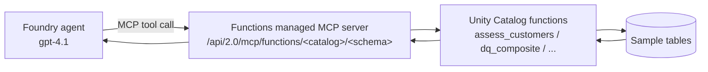

# Unity Catalog Functions managed MCP server

**Status: built in this demo.** &nbsp;·&nbsp; **Preview:** Databricks managed MCP servers are
Public Preview.

Expose governed **Unity Catalog functions** to a Microsoft Foundry agent as tools through
the Databricks **functions managed MCP server**. This is the best fit for **deterministic,
repeatable** data quality scoring: the logic lives in Unity Catalog (versioned, governed,
testable) and the agent simply calls it.

## When to use it
- You want **deterministic** results the agent cannot hallucinate — the scoring is SQL, not
  model output.
- You want the quality logic **governed and reusable** across agents, notebooks, and jobs.
- You have a known set of tables/checks (as in this demo).

## How it works



Endpoint:

```
https://<databricks-host>/api/2.0/mcp/functions/<catalog>/<schema>
```

All functions in that schema become callable tools. In this demo (`<catalog>`/`quality`)
that includes:

| Function | Kind | What it does |
|----------|------|--------------|
| `dq_ratio_score(issues, checks)` | scalar | `1 - issues/checks`, clamped to [0,1]. |
| `dq_freshness_score(age_days, target_days)` | scalar | Timeliness score from data age. |
| `dq_composite(6 scores)` | scalar | Mean of the six dimension scores. |
| `dq_severity(score)` | scalar | Healthy / Needs Attention / High Risk / Critical. |
| `dq_recommend(score)` | scalar | Suggested action for a score. |
| `assess_customers()` | table | Full six-dimension scorecard for `customers`. |
| `assess_orders()` | table | Full six-dimension scorecard for `orders`. |
| `assess_products()` | table | Full six-dimension scorecard for `products`. |

## Why per-table functions?
Unity Catalog SQL functions **cannot run dynamic SQL**, so a single "assess any table"
function is not possible in pure SQL. This demo ships explicit `assess_*` functions for the
sample tables. For arbitrary tables, use the [Genie managed MCP server](genie-managed-mcp.md)
or a [custom MCP server](custom-mcp-server.md), both of which generate SQL
dynamically. This is a deliberate trade-off: governed functions buy determinism and
governance at the cost of generality.

## Prerequisites
- Sample data **and** functions loaded (run `01`–`03` from [`/databricks`](../../databricks)).
- **Managed MCP Servers** preview turned on for the workspace — a portal toggle under your
  **username → Previews** (workspace admin required). See
  [Databricks workspace → Enable the Managed MCP Servers preview](../services/databricks-workspace.md#enable-the-managed-mcp-servers-preview).
- A Foundry project with a `gpt-4.1` deployment.
- Roles: a Databricks identity with `USE CATALOG` / `USE SCHEMA` / `EXECUTE` on the
  functions; **Foundry User** on the Foundry project.

## Step 1 — Confirm the functions exist
Open a SQL editor: in the left sidebar under **SQL**, click **SQL Editor**, then **+ New query**. Pick a running **SQL warehouse** in the selector at the top of the editor.

Run the following, replacing `<catalog>` and `<schema>` with the names you used in setup (for example the catalog and its `quality` schema). The angle brackets are placeholders — a statement like `SHOW USER FUNCTIONS IN <catalog>.<schema>;` left as-is will fail with a `PARSE_SYNTAX_ERROR`:
```sql
SHOW USER FUNCTIONS IN <catalog>.<schema>;
```
Click **Run** (Ctrl+Enter). You should see the `dq_*` and `assess_*` functions. Sanity-check one:
```sql
SELECT * FROM <catalog>.<schema>.assess_customers();
```

## Step 2 — Add the functions MCP server as a tool in Foundry
The functions server is a **custom/remote MCP** connection (there is no first-party tile for
it like there is for Genie), so add it via the generic MCP tool flow:
1. In **Microsoft Foundry**, open your agent → **Playground** → **Tools** dropdown → **Add**.
2. On the **Custom** tab, select **Model Context Protocol (MCP)** → **Create**.
3. Fill in:
   - **Name:** e.g. `databricks-uc-functions`.
   - **Remote MCP Server endpoint:**
     `https://<databricks-host>/api/2.0/mcp/functions/<catalog>/<schema>`.
   - **Authentication:** OAuth identity passthrough (**Managed** / Entra recommended).
4. Select **Connect**, then **Save** to attach the tool to the agent.

## Step 3 — Consent and test
1. In the agent Playground, enter a governed-function prompt (see
   [`agent/sample-prompts.md`](../../agent/sample-prompts.md)), e.g. *"Assess the customers
   table and give me the composite score and severity."*
2. If using OAuth passthrough, click **Open Consent** and sign in with your Entra account.
3. **Approve** the tool call when prompted.
4. Confirm the agent returns real numbers — `products` Healthy (~1.0), `customers`/`orders`
   High Risk with concrete findings.

## Extending the checks
Add a new dimension or table by writing another Unity Catalog function in
`databricks/sql/03_quality_functions.sql` and re-running it. It becomes an agent tool
automatically (all functions in the schema are exposed) — no Foundry change required beyond
re-consent if permissions change.

## References
- [Azure Databricks managed MCP servers](https://learn.microsoft.com/azure/databricks/generative-ai/mcp/managed-mcp)
- [Unity Catalog SQL UDFs](https://learn.microsoft.com/azure/databricks/udf/unity-catalog)
- [Connect an MCP server to a Foundry agent](https://learn.microsoft.com/azure/azure-functions/functions-mcp-foundry-tools)
