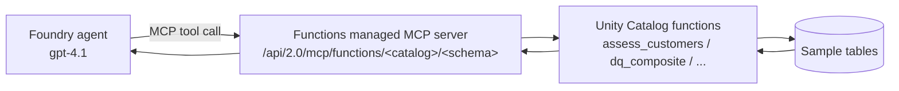

# Unity Catalog Functions managed MCP server

**Status: built in this demo.** &nbsp;·&nbsp; **Preview:** Databricks managed MCP servers are
Public Preview.

Expose governed **Unity Catalog functions** to a Microsoft Foundry agent as tools through
the Databricks **functions managed MCP server**. This is the best fit for **deterministic,
repeatable** data quality scoring: the logic lives in Unity Catalog (versioned, governed,
testable) and the agent simply calls it.

## When to use it
- You want **deterministic** results the agent cannot hallucinate — the scoring is SQL, not
  model output.
- You want the quality logic **governed and reusable** across agents, notebooks, and jobs.
- You have a known set of tables/checks (as in this demo).

## How it works



Endpoint:

```
https://<databricks-host>/api/2.0/mcp/functions/<catalog>/<schema>
```

All functions in that schema become callable tools. In this demo (schema `quality`) that
includes:

| Function | Kind | What it does |
|----------|------|--------------|
| `dq_ratio_score(issues, checks)` | scalar | `1 - issues/checks`, clamped to [0,1]. |
| `dq_freshness_score(age_days, target_days)` | scalar | Timeliness score from data age. |
| `dq_composite(6 scores)` | scalar | Mean of the six dimension scores. |
| `dq_severity(score)` | scalar | Healthy / Needs Attention / High Risk / Critical. |
| `dq_recommend(score)` | scalar | Suggested action for a score. |
| `assess_customers()` | table | Full six-dimension scorecard for `customers`. |
| `assess_orders()` | table | Full six-dimension scorecard for `orders`. |
| `assess_products()` | table | Full six-dimension scorecard for `products`. |

## Why per-table functions?
Unity Catalog SQL functions **cannot run dynamic SQL**, so a single "assess any table"
function is not possible in pure SQL. This demo ships explicit `assess_*` functions for the
sample tables. For arbitrary tables, use the [Genie managed MCP server](genie-managed-mcp.md)
or a [custom MCP server](custom-mcp-server.md), both of which generate SQL
dynamically. This is a deliberate trade-off: governed functions buy determinism and
governance at the cost of generality.

## Prerequisites
- Sample data **and** functions loaded (run `01`–`03` from [`/databricks`](../../databricks)).
- **Managed MCP Servers** preview turned on for the workspace — a portal toggle under your
  **username → Previews** (workspace admin required). See
  [Databricks workspace → Enable the Managed MCP Servers preview](../services/databricks-workspace.md#enable-the-managed-mcp-servers-preview).
- A Foundry project with a `gpt-4.1` deployment.
- Workspace-admin access to Databricks (to register a service principal and run `GRANT`s),
  and **Foundry User** (or higher) on the Foundry project.

## Step 1 — Confirm the functions exist
Open a SQL editor: in the left sidebar under **SQL**, click **SQL Editor**, then **+ New query**. Pick a running **SQL warehouse** in the selector at the top of the editor.

Run the following, replacing `<catalog>` and `<schema>` with the names you used in setup (for example the catalog and its `quality` schema). The angle brackets are placeholders — a statement like `SHOW USER FUNCTIONS IN <catalog>.<schema>;` left as-is will fail with a `PARSE_SYNTAX_ERROR`:
```sql
SHOW USER FUNCTIONS IN <catalog>.<schema>;
```
Click **Run** (Ctrl+Enter). You should see the `dq_*` and `assess_*` functions. Sanity-check one:
```sql
SELECT * FROM <catalog>.<schema>.assess_customers();
```

## Step 2 — Authorize the Foundry project's managed identity in Databricks
The functions MCP server authenticates with **Microsoft Entra**. The cleanest option is the
Foundry **project's managed identity** — a service identity, so there is **no user sign-in, no
OAuth app, and no personal access token**. Before Foundry can call the functions, that identity
must exist in Databricks and hold the right Unity Catalog privileges.

1. **Get the identity.** In the Azure portal, open your **Foundry project** resource →
   **Identity → System assigned**, and note the **Application (client) ID** of its managed
   identity (referred to below as `<project-mi-app-id>`).
2. **Register it in the workspace.** As a Databricks workspace admin, go to
   **Settings → Identity and access → Service principals → Add service principal →
   Microsoft Entra managed**, paste `<project-mi-app-id>`, and grant it **Workspace access**.
3. **Grant Unity Catalog privileges.** In a SQL editor, run the following (replace the
   placeholders) — this is packaged as
   [`databricks/sql/05_grant_mcp_identity.sql`](../../databricks/sql/05_grant_mcp_identity.sql):
   ```sql
   GRANT USE CATALOG ON CATALOG <catalog> TO `<project-mi-app-id>`;
   GRANT USE SCHEMA, SELECT, EXECUTE ON SCHEMA <catalog>.<schema> TO `<project-mi-app-id>`;
   ```
   `SELECT` and `EXECUTE` on the schema cascade to every table and function in it.

> **Ownership chaining — do this too.** A Unity Catalog SQL function runs its body with the
> **function owner's** identity, not the caller's. If `<catalog>` is a workspace **default
> catalog** (owned by a workspace-admins group), the function owner may hold catalog access only
> *implicitly*, which breaks the chain and fails at call time with
> `INSUFFICIENT_PERMISSIONS … the owner of one of the underlying resources failed an
> authorization check` (SQLSTATE `42501`). Grant the **owner** explicit privileges once:
> ```sql
> -- find the owner: SELECT DISTINCT routine_owner
> --   FROM <catalog>.information_schema.routines WHERE specific_schema='<schema>';
> GRANT USE CATALOG ON CATALOG <catalog> TO `<function-owner>`;
> GRANT USE SCHEMA, SELECT, EXECUTE ON SCHEMA <catalog>.<schema> TO `<function-owner>`;
> ```

## Step 3 — Add the functions MCP server as a tool in Foundry
Use the **same agent** you connected Genie to, or create one first (see
[`agent/README.md`](../../agent/README.md)). An agent holds multiple tools, so adding the
functions server sits **alongside** Genie — it does not replace it.

The functions server is a **custom/remote MCP** connection (there is no first-party tile for
it like there is for Genie), so add it via the generic MCP tool flow:
1. In **Microsoft Foundry**, open your agent. In the right-hand **Setup** pane, find the
   **Tools** section (if you already added **Azure Databricks Genie**, it appears here too).
2. Click **Add**, then choose **Browse all tools** at the bottom of the menu.
3. In the **Select a tool** dialog, open the **Custom** tab and choose
   **Model Context Protocol (MCP)**.
4. In the **Add Model Context Protocol tool** dialog, fill in:

   | Field | Value |
   |-------|-------|
   | **Name** | `databricks-uc-functions` |
   | **Remote MCP Server endpoint** | `https://<databricks-host>/api/2.0/mcp/functions/<catalog>/<schema>` |
   | **Authentication** | **Microsoft Entra** |
   | **Type** | **Project Managed Identity** |
   | **Audience** | `2ff814a6-3304-4ab8-85cb-cd0e6f879c1d` |

   The **Audience** is Azure Databricks' fixed first-party Entra application ID — it is the
   **same value in every tenant**, so copy it verbatim.
5. Select **Connect**, then **Create** to attach the tool to the agent.

> **Why Project Managed Identity?** It is generally available and needs no per-user consent
> (contrast with Genie's user passthrough). *Agent Identity* is an alternative but is still in
> Preview.

## Step 4 — Steer tool selection with agent Instructions
The agent now holds **two** data tools — Genie (open-ended) and the UC functions (governed
scoring). The model routes on tool **names and descriptions**, so without guidance it may
answer a scoring question from Genie. Make the choice deterministic: in the agent's
**Instructions** box, add the following and click **Save**.

```
You are a data quality assistant for Azure Databricks Unity Catalog.

- To score the data quality of a specific table (customers, orders, or
  products), you MUST use the databricks-uc-functions tools:
  assess_customers, assess_orders, assess_products. These return the
  governed composite score (0-1) and severity.
- Use Azure Databricks Genie ONLY for open-ended or exploratory questions
  that the assessment functions do not cover.
- Never report a table's data-quality score from Genie when an assess_*
  function exists for that table.
```

## Step 5 — Test both paths
1. **Governed scoring (UC functions).** Prompt: *"Assess the customers table and give me the
   composite score and severity."* Because the tool uses a **service identity, there is no
   consent prompt.** Expect a six-dimension scorecard — `customers` composite ≈ **0.77
   (High Risk)** with **Timeliness** the critical dimension, and `products` ≈ **1.0 (Healthy)**.
   Open **Traces** and confirm the tool span reads **`databricks-uc-functions`**.
2. **Open-ended (Genie).** Prompt something the functions do not cover, e.g. *"Which product
   category has the most orders, and what's the total revenue for it?"* The trace span should
   read **`AzureDatabricksGenie`** (first use triggers the one-time Genie consent).

## Extending the checks
Add a new dimension or table by writing another Unity Catalog function in
`databricks/sql/03_quality_functions.sql` and re-running it. It becomes an agent tool
automatically (all functions in the schema are exposed) — no Foundry change required. The
project managed identity already holds `EXECUTE` on the schema, so new functions are covered
without re-granting.

## References
- [Azure Databricks managed MCP servers](https://learn.microsoft.com/azure/databricks/generative-ai/mcp/managed-mcp)
- [Unity Catalog SQL UDFs](https://learn.microsoft.com/azure/databricks/udf/unity-catalog)
- [Connect an MCP server to a Foundry agent](https://learn.microsoft.com/azure/foundry/agents/how-to/tools/model-context-protocol)
