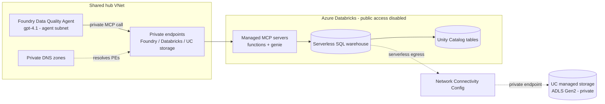

# Private networking

This guide builds the **Data Quality Agent** with **no public network access** end to end:
a Microsoft Foundry project and an Azure Databricks workspace that reach each other — and the
two managed MCP integration paths (Unity Catalog Functions and Genie) — entirely over Azure
**Private Link**, private endpoints, and private DNS.

It is the private counterpart to the public reference build. The agent, the six-dimension
quality model, and both managed MCP paths are **unchanged** — only the network posture changes.

> **Scope.** This page covers **Option A (serverless)**: the two already-built managed MCP
> paths running private on serverless SQL. **Option B (dedicated compute)** — a custom MCP
> server on a dedicated Pro warehouse — is now **built**; see
> [`custom-mcp-server.md`](integration/custom-mcp-server.md).

All bracketed values (e.g. `<shared-vnet>`, `<databricks-host>`, `<foundry-account>`,
`<project-name>`, `<catalog>`, `<schema>`, `<genie-space-id>`) are placeholders — substitute
your own. The example address ranges are illustrative; align them to your own IP plan.

---

## What "private" means here

| Surface | Public build | Private build |
|---------|--------------|---------------|
| Databricks workspace UI/REST (incl. `/api/2.0/mcp/*`) | Public endpoint | **Front-end Private Link**, `publicNetworkAccess=Disabled` |
| Databricks serverless egress → Unity Catalog storage | Public/Microsoft backbone | **Network Connectivity Config (NCC)** private endpoint |
| Unity Catalog managed storage (ADLS Gen2) | Public endpoint | **Private endpoints** (blob + dfs), public access disabled |
| Foundry account/project + its Search/Storage/Cosmos deps | Public endpoints | **Private endpoints**, network-injected account |
| Foundry agent → Databricks managed MCP | Over the internet | **Private** — agent subnet resolves the workspace to a private IP |
| Name resolution | Azure public DNS | **Private DNS zones** linked to the VNet |

The result: an agent turn that scores a table never leaves the private network — Foundry's
agent subnet calls the Databricks managed MCP endpoint at a private IP, and Databricks
serverless reaches Unity Catalog storage over its NCC private endpoint.

---

## Architecture

### Reuse vs. new

This build deploys as a **spoke that consumes an existing shared hub** (VNet, VPN/gateway,
DNS resolver, private-endpoint subnet, and most `privatelink.*` DNS zones already exist). Only
the Databricks-specific pieces are net-new. If you have no shared hub, create the equivalent:
a VNet with a private-endpoint subnet, a way to reach it privately (VPN/Bastion/peered
management network), and a DNS resolver so clients resolve the private zones.

---

## Address plan (example)

Adjust to your own non-overlapping ranges.

| Purpose | Example prefix |
|---------|----------------|
| Shared hub VNet | `10.x.0.0/22` |
| Private-endpoint subnet | `10.x.0.0/26` |
| Foundry agent subnet | `10.x.0.x/27` |
| Databricks host (public) subnet — delegated | `10.x.0.192/26` |
| Databricks container (private) subnet — delegated | `10.x.1.64/26` |

Both Databricks subnets are delegated to `Microsoft.Databricks/workspaces` and share one NSG
(Databricks manages that NSG's rules itself).

---

## Private DNS zones

Link each zone to the VNet (registration disabled) so private endpoints resolve to private IPs
for every client on the VNet (and VPN/peered clients via the DNS resolver).

| Zone | For |
|------|-----|
| `privatelink.azuredatabricks.net` | Databricks workspace front-end (UI/API, incl. managed MCP) |
| `privatelink.dfs.core.windows.net` | Unity Catalog / DBFS ADLS Gen2 (dfs) |
| `privatelink.blob.core.windows.net` | Unity Catalog managed storage (blob) |
| `privatelink.services.ai.azure.com` (+ `openai`, `cognitiveservices`) | Foundry account/project data plane |
| `privatelink.vaultcore.azure.net`, `privatelink.search.windows.net`, `privatelink.documents.azure.com` | Key Vault, AI Search, Cosmos DB (Foundry deps) |

In a shared-hub topology most of these already exist; typically only the two Databricks zones
are net-new. Bicep: [`infra/private/dns-zones.bicep`](../infra/private/dns-zones.bicep).

---

## Step 1 — Databricks VNet-injection subnets

Azure Databricks only permits `publicNetworkAccess=Disabled` on a **VNet-injected** workspace,
so even though serverless is the primary compute you must create the two delegated host/container
subnets and an NSG first.

Bicep: [`infra/private/databricks-subnets.bicep`](../infra/private/databricks-subnets.bicep).

## Step 2 — Private Databricks workspace

Deploy a **Premium** workspace (required for Unity Catalog, serverless SQL, and managed MCP):

- `publicNetworkAccess = Disabled`
- `requiredNsgRules = NoAzureDatabricksRules` (required when public access is off)
- VNet-injected into the host/container subnets; Secure Cluster Connectivity (`enableNoPublicIp`) on
- Two **front-end private endpoints** into the private-endpoint subnet:
  - `databricks_ui_api` — web UI + REST API, **including the `/api/2.0/mcp/*` managed MCP endpoints**
  - `browser_authentication` — Entra ID SSO sign-in
- Both PEs resolve via `privatelink.azuredatabricks.net`.

Bicep: [`infra/private/databricks-workspace.bicep`](../infra/private/databricks-workspace.bicep).

> After this step the workspace is reachable **only** from the private network. Do all
> subsequent Databricks work (CLI, SQL, seeding) from a client on the VNet or VPN.

## Step 3 — Unity Catalog storage (private)

Deploy the ADLS Gen2 account backing the Unity Catalog catalog, plus a Databricks Access
Connector (system-assigned identity, granted **Storage Blob Data Contributor**):

- `blob` + `dfs` **front-end private endpoints** (management access from the VNet/DevBox)
- `allowBlobPublicAccess=false`, `allowSharedKeyAccess=false`, HNS enabled
- Set `storagePublicNetworkAccess=Disabled` **once the NCC private path (Step 4) is validated**

Bicep: [`infra/private/uc-storage.bicep`](../infra/private/uc-storage.bicep).

## Step 4 — Network Connectivity Config (NCC) for serverless egress

Serverless SQL does **not** run in your injected subnets, so front-end Private Link alone does
not make serverless→storage traffic private. Create a **Network Connectivity Configuration**,
add **private-endpoint rules** to the Unity Catalog storage (`blob` + `dfs`), **approve** the
managed private endpoints, and **bind** the NCC to the workspace.

This is an **account-level** operation (Databricks account console / account API), not
ARM/Bicep. After the NCC private endpoints are approved and bound, disable storage public
access (Step 3).

> **Serverless vs. classic — the key trade-off.** Serverless private egress uses an **NCC**
> (this build, Option A). Classic/dedicated compute instead runs in your injected subnets and
> uses **back-end Private Link** (relay + REST API) — that's **Option B**, needed only when you
> add the custom MCP server on dedicated compute. You don't need back-end Private Link for the
> serverless managed-MCP paths.

## Step 5 — Private Foundry project

Add the Data Quality Agent **project** to a **network-injected** Foundry account (agent subnet
+ private-endpoint subnet), reusing the account's dependent **AI Search / Storage / Cosmos DB**
(each behind private endpoints with centralized private DNS). The project uses a
**system-assigned managed identity**; a capability host enables Agents.

Bicep (module set): [`infra/private/foundry/`](../infra/private/foundry/) — `main.bicep`
orchestrates `project` → account RBAC → capability host → container RBAC.

> **Shared-account note.** Foundry connection names are unique **within the account**. If you
> add this project to an account that already hosts other projects, give its connections
> project-unique names (the Bicep does this: `<project-name>-cosmosdb` / `-storage` / `-search`).

## Step 6 — Cross-network DNS

Confirm the **Foundry agent subnet** resolves the Databricks workspace FQDN
(`<databricks-host>`) to its **private** IP via `privatelink.azuredatabricks.net`. Because the
zone is linked to the shared VNet, the agent subnet inherits resolution automatically — verify
with a DNS lookup from a client on the VNet. This is what keeps managed MCP calls private.

## Step 7 — Seed data + register the MCP identity

From a private client, create the catalog/schema, load the sample tables, and create the
quality functions, then grant the **project managed identity** access:

- `USE CATALOG` + `USE SCHEMA`, `SELECT`, and `EXECUTE` on `<catalog>.<schema>`
- Function owner = the catalog owner, so **ownership chaining** lets the MI execute the
  governed functions without direct grants on underlying tables.

See [`/databricks`](../databricks) for the runnable SQL and the grant script.

## Step 8 — Wire the two managed MCP paths (private)

Create the agent and attach both managed MCP tools **in the Foundry portal** (the tool-wiring
is a Public Preview click-op — it creates a Foundry connection for you; it is not scriptable via
the Agents API today). The two paths use **different** auth models:

- **UC Functions MCP** — `https://<databricks-host>/api/2.0/mcp/functions/<catalog>/<schema>`
  Auth: **Microsoft Entra → Project Managed Identity**, audience
  `2ff814a6-3304-4ab8-85cb-cd0e6f879c1d` (the Azure Databricks first-party application ID — the
  same value in every tenant). A service identity: **no secrets, no user sign-in, no consent**.
- **Genie MCP** — `https://<databricks-host>/api/2.0/mcp/genie/<genie-space-id>`
  Auth: **OAuth Identity Passthrough (Managed)** — Genie runs **as the signed-in user**, so the
  first call prompts a one-time Entra sign-in/consent in the Playground.

> **Connection names** allow letters, numbers, dashes, and dots only — **no underscores**
> (e.g. `databricks-uc-functions`, `databricks-genie`).

Follow the integration pages for the exact tool setup — they apply unchanged in the private
build (only the host now resolves to a private IP):
[UC Functions managed MCP](integration/uc-functions-managed-mcp.md) ·
[Genie managed MCP](integration/genie-managed-mcp.md).

> **Preview / portal steps.** Enabling the Managed MCP Servers preview, creating the Genie
> space, and connecting the MCP tools to the agent are Public Preview portal ("click-ops")
> steps — not ARM/Bicep-deployable today. They are identical to the public build.

---

## Verify it's private

1. **Public access is off.** Confirm `publicNetworkAccess=Disabled` on the workspace and that
   the workspace host resolves to a **private** IP from a VNet/VPN client (and is unreachable
   from the public internet).
2. **UC Functions path.** Ask the agent to *"assess the customers table."* Expect a
   `databricks-uc-functions` tool span and a composite score in the **High Risk** band
   (≈ 0.77 on the sample data). Traffic stays on the private network.
3. **Genie path.** Ask an ad-hoc natural-language question (e.g. a row count). Expect an
   `AzureDatabricksGenie` / `query_space` span that generates and runs SQL against
   `<catalog>.<schema>` — again fully private.

---

## What is / isn't Infrastructure-as-Code

- **Bicep-deployable** ([`infra/private/`](../infra/private/)): Databricks subnets + NSG, the
  private workspace + front-end PEs, UC storage + PEs, the private DNS zones, and the Foundry
  project module set (project, RBAC, capability host).
- **Account/portal / preview (not Bicep):** the **NCC** and its private-endpoint rules
  (account-level API), enabling the Managed MCP Servers preview, creating the **Genie space**,
  and connecting the **MCP tools** to the agent.

---

## Option B (dedicated compute, custom MCP) — built

The **custom MCP server** runs on dedicated/classic compute. As built in this project:

- A **dedicated Pro SQL warehouse** (not serverless) in the existing private workspace.
- The **custom MCP server** on a **private, internal Azure Container App**, pulling its image
  from the private ACR and calling the Pro warehouse via the SQL Statement Execution API.
- **Front-end Private Link** to the workspace is sufficient for the Statement Execution API
  path; **back-end Private Link** (SCC relay + REST for classic clusters) is optional hardening,
  documented but not required here.
- Auth is **OAuth Identity Passthrough** (Custom provider) — the signed-in user's Databricks
  token is forwarded through to Unity Catalog.

For a fully isolated deployment you may additionally use a dedicated spoke VNet with **VNet
injection** + **Secure Cluster Connectivity** + back-end Private Link. See
[`custom-mcp-server.md`](integration/custom-mcp-server.md).
